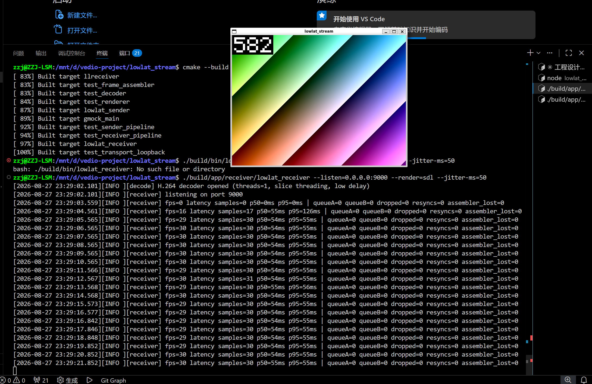

# LowLat Stream

> 面向**弱网环境**的低延迟视频传输系统：自研 UDP 传输层（分片 / FEC / NACK 重传 / 自适应抖动缓冲），
> 配 C++ 分发服务端（一推多拉），端到端可观测。

C++17 · CMake · GoogleTest · Linux(WSL2)

---

## 架构

```text
┌────────────┐        ┌──────────────────┐        ┌────────────┐
│  推流端     │        │    分发服务端      │        │  接收端     │
│ 采集→编码   │──UDP──▶│ 房间/配对/转发     │──UDP──▶│ 组包→解码   │
│ 分片→FEC    │◀─NACK──│ 指标采集(Redis)   │◀─NACK──│ 抖动缓冲→渲染│
└────────────┘        └──────────────────┘        └────────────┘
                              │
                         HTTP 指标查询
```

## 当前进度

| 里程碑 | 内容 | 状态 |
|---|---|---|
| **M0** | 工程骨架：CMake / 日志 / 配置 / 状态码 / 有界队列 / 单测 | ✅ 完成（tag `m0-skeleton`） |
| **M1** | 采集 + 编码：Null 源 / V4L2 源 → 两线程管线 → H.264 | ✅ 完成（tag `m1-capture-encode`） |
| **M2** | UDP 传输：自研协议 / 分片打包 / 组包 / 丢包乱序统计 | ✅ 完成（tag `m2-transport`） |
| **M3** | 接收端：抖动缓冲 / H.264 解码 / SDL 渲染 → 三线程管线出画面 | ✅ 完成 |
| M4 | 弱网对抗：NACK / FEC / jitter buffer / PLI ⭐ | ⬜ |
| M5 | 分发服务端：房间 + 一推多拉 + 背压 ⭐ | ⬜ |
| M6 | Redis 指标 + HTTP API + 压测报告 | ⬜ |

> M3 打通了全链路「采集 → 编码 → 分片 → UDP → 组包 → 抖动缓冲 → 解码 → 渲染」，
> 本机回环端到端 **p50 5ms / p99 7ms**（不含抖动缓冲的目标水位），900 帧零丢弃。
> 数据和复现命令见 [跑一遍 M3](#跑一遍-m3)。
> `lowlat_server` 仍是空壳；弱网下的表现（丢包/乱序注入）和单机路数留给 M4/M6。



---

## 构建与运行

依赖：CMake ≥ 3.16、支持 C++17 的编译器、pthread、FFmpeg 开发包（编解码与色彩转换），
以及 SDL2（接收端渲染；CMake 里是 `REQUIRED`，不是可选的）。
GoogleTest 由 CMake `FetchContent` 自动拉取（首次构建需要联网）。

```bash
sudo apt install -y build-essential cmake pkg-config \
     libavcodec-dev libavutil-dev libswscale-dev libsdl2-dev
cmake -S . -B build -DCMAKE_BUILD_TYPE=Release
cmake --build build -j
ctest --test-dir build --output-on-failure
```

`pkg_check_modules` 查的是 pkg-config 的 `.pc` 文件，只有 `-dev` 包才带；装完若仍报
`Package 'libswscale' not found`，删掉 `build/` 重新 configure —— 查找失败的结果会进
`CMakeCache.txt`，不删缓存会一直沿用旧结论。

三个可执行：

```bash
./build/app/sender/lowlat_sender     --help
./build/app/receiver/lowlat_receiver --log-level=debug
./build/app/server/lowlat_server     --config conf/server.conf
```

### 通用参数

| 参数 | 默认 | 说明 |
|---|---|---|
| `--help` | — | 打印用法并退出 |
| `--log-level <lv>` | `info` | `trace` / `debug` / `info` / `warn` / `error` |
| `--config <file>` | — | 配置文件，`key=value` 每行一条，`#` 注释 |
| `--listen <addr:port>` | `0.0.0.0:9000` | 服务端 / 接收端监听地址 |
| `--target <addr:port>` | `127.0.0.1:9000` | 发送目标地址 |

`--key=value` 和 `--key value` 两种写法都支持；优先级 **命令行 > 配置文件 > 默认值**；
未知参数**报错退出**，不静默忽略。

### sender 参数

| 参数 | 默认 | 说明 |
|---|---|---|
| `--source <kind>` | `null` | `null` 合成画面源 / `v4l2` 摄像头源 |
| `--device <path>` | `/dev/video0` | V4L2 设备节点，仅 `--source=v4l2` 使用 |
| `--width` `--height` `--fps` | `640` `480` `30` | 期望采集参数，**驱动可能给出不同的值** |
| `--bitrate <kbps>` | `2000` | 编码码率 |
| `--gop <n>` | 同 `--fps` | 关键帧间隔（**单位是帧**，不是秒） |
| `--cap <n>` | `4` | 采集→编码队列容量 |
| `--send-cap <n>` | `4` | 编码→发送队列容量 |
| `--target <addr:port>` | `127.0.0.1:9000` | 发送目标；**传空串 `--target=` 表示不发送**，退回 M1 的纯本地 dump |
| `--frames <n>` | `100` | 采集帧数上限；`0` 表示一直跑到 Ctrl-C |
| `--dump <file>` | — | 落 H.264 Annex B 裸流 |
| `--dump-raw <file>` | — | 落编码前的 YUV420P 原始帧 |

分辨率和帧率是**期望值不是承诺值**：摄像头驱动可以只给相近的值，实际协商结果会打一条
INFO，编码器按**实际值**打开。

注意 `--target` **默认是开着的**：不带这个参数跑 sender，它也会往 `127.0.0.1:9000` 发。
没人监听时不会报错（UDP 无连接），只是白发一遍。想完全关掉网络这一级用 `--target=`——
排查问题时这一档很有用，它能一句话把范围劈成两半：关掉发送还坏就是采集/编码的事。

### receiver 参数

| 参数 | 默认 | 说明 |
|---|---|---|
| `--listen <addr:port>` | `0.0.0.0:9000` | 监听地址；`:9000` 表示所有网卡 |
| `--dump <file>` | — | 落还原出的 H.264 Annex B 裸流 |
| `--frames <n>` | `0`（不限） | 收够 N 个**完整帧**后退出 |
| `--idle-timeout <ms>` | `0`（不超时） | 连续这么久没收到**任何包**就退出，脚本化验收要靠它 |
| `--recv-timeout <ms>` | `200` | 单次收包等待上限，决定 Ctrl-C 的最坏响应延迟 |
| `--render <kind>` | `sdl` | `sdl` 开窗显示 / `null` 只校验不开窗 / **空串 `--render=` 表示不解码不渲染**，退回 M2 的纯落盘 |
| `--jitter-ms <ms>` | `50` | 抖动缓冲的目标水位，直接加在端到端延迟上 |
| `--threads <n>` | `1` | 解码器线程数 |
| `--vsync <0\|1>` | `0` | 渲染是否等垂直同步；开了帧率就被显示器接管，测延迟时应保持 `0` |
| `--stats-interval <ms>` | `1000` | 每隔多久打一行运行时统计；`0` 表示不打 |

`--render` 的三档对应三种用途：`sdl` 是给人看的，`null` 是给脚本看的（逐帧校验尺寸、
格式、时间戳单调性，不需要 X server），空串则把解码渲染整段摘掉——排查问题时这一档
能一句话把范围劈成两半，和 sender 的 `--target=` 是同一个用法。

`--idle-timeout` 计的是"多久没收到包"而不是"多久没组齐帧"：只收到分片却一直组不齐时
网络显然还活着，按帧计时会把"一直丢包"误判成"对端已停止"，接收端自己退出。

### 跑一遍 M1

```bash
# 合成画面源：无需任何硬件
./build/app/sender/lowlat_sender --source=null --frames=300 --dump=out_null.h264
ffplay out_null.h264          # 能看到色块和递增的帧号
```

V4L2 这条路用 **v4l2loopback 虚拟设备**验证，不依赖物理摄像头（原因见
[NOTES 第 17 条](docs/NOTES.md)）：

```bash
sudo apt install -y v4l2loopback-dkms v4l-utils ffmpeg
sudo modprobe v4l2loopback video_nr=0 exclusive_caps=1

# 另开一个终端挂着，持续往虚拟设备推固定测试图案
ffmpeg -re -f lavfi -i testsrc=size=640x480:rate=30 -pix_fmt yuyv422 -f v4l2 /dev/video0

./build/app/sender/lowlat_sender --source=v4l2 --frames=300 --dump=out_v4l2.h264
ffplay out_v4l2.h264
```

真设备冒烟测试默认跳过，指定设备后才会运行：

```bash
LOWLAT_V4L2_DEVICE=/dev/video0 ctest --test-dir build --output-on-failure
```

### 跑一遍 M2

两个进程，本机回环。先起接收端（它会打印实际监听的端口），再起发送端：

```bash
./build/app/receiver/lowlat_receiver \
    --listen=127.0.0.1:9100 --dump=recv.h264 --idle-timeout=1500 &

./build/app/sender/lowlat_sender \
    --source=null --frames=60 --dump=send.h264 --target=127.0.0.1:9100
wait

cmp send.h264 recv.h264 && echo "逐字节一致"
```

两端的日志要能对上——这比"能播放"更能说明问题：

```text
[sender]   stopped: captured=60 encoded=60 bytes=400995 ... packets_sent=356 send_errors=0
[receiver] stopped: frames=60 bytes=400995 packets=356 lost=0 malformed=0 dropped=0
```

**验收判据是 `cmp` 而不是 ffplay**：播放器对残缺码流很宽容，少了一个分片照样往下播，
花那么几帧屏靠肉眼根本发现不了。字节比对是唯一能把"看起来对"和"真的对"分开的东西。

丢包和畸形包在统计里是**两条线**：`lost` 说明网络差，`malformed` 说明对端在乱发或者
版本对不上，处置方式完全不同，混成一个数就没法定位了。

日志输出到 stderr，格式固定（M6 要靠脚本解析它算指标）：

```text
[2026-07-27 08:15:02.123][INFO ][sender] sender starting
```

### 跑一遍 M3

WSL2 下窗口靠 WSLg 直接出来，不需要额外配 X server。

```bash
# 终端 A：接收端先起，它要先占住端口
./build/app/receiver/lowlat_receiver --listen=0.0.0.0:9000 --render=sdl --jitter-ms=50

# 终端 B：合成画面源，30 秒
./build/app/sender/lowlat_sender --source=null --target=127.0.0.1:9000 --frames=900 --fps=30
```

窗口里是递增的帧号叠在色带上——**帧号是验收的一部分**：色带花没花肉眼分得出，但帧
掉没掉、顺序乱没乱，只有帧号说得清。接收端每秒打一行运行时统计，退出时再打两行总结
（下面的 `stopped:` 实际是一行，这里为了可读折了行）：

```text
[receiver] fps=30 latency samples=30 p50=54ms p95=55ms | queueA=0 queueB=0 dropped=0 resyncs=0 assembler_lost=0
[receiver] latency total: samples=900 p50=55ms p95=56ms p99=57ms max=126ms
[receiver] stopped: frames=900 bytes=7829139 key=30 packets=6978 lost=0 malformed=0 dropped=0
           recv_errors=0 jitter_dropped=0 queue_dropped=0 resyncs=0 decoded=900 rendered=900
           queue_peak=1/2 elapsed=52106ms
```

无头验收（不开窗，可进 CI）：

```bash
./build/app/receiver/lowlat_receiver --listen=0.0.0.0:9000 --render=null --frames=100 &
./build/app/sender/lowlat_sender --source=null --target=127.0.0.1:9000 --frames=100
wait
```

`--render=null` 不开窗，但逐帧校验尺寸、像素格式、`captureMs` 与 `frameId` 的单调性，
不合法的帧计入 `framesRejected`。判据是 `rendered=100`，**一帧不少**。

#### 实测延迟

本机回环（WSL2，单机双进程），640×480@30fps，2000kbps，gop=30，900 帧：

| 统计量 | `--jitter-ms=0` | `--jitter-ms=50` |
|---|---|---|
| p50 | **5ms** | 55ms |
| p95 | 6ms | 56ms |
| p99 | **7ms** | 57ms |
| max | 19ms | 126ms |
| 丢帧 | 0 | 0 |

**三个分位数同时平移了整整 50ms，`max` 没有** —— 这正是选分位数而不是 mean/max 的理由：
两个 `max` 都是各自的第一帧（SDL 建窗 + 首张 texture + 解码器预热），跟稳态无关，
用它描述"这套系统有多快"会得出错误结论。

`--jitter-ms=0` 那一列是**管线自身的开销**：组包 → 解码 → 队列 B → 渲染，全程 5ms，
占 33ms 每帧预算的 15%。从中位数到 p99 只差 2ms（5 → 7），也就是说 900 帧里最慢的
那 1% 也只比典型帧慢 2ms——这是回环该有的样子，跨机器时会立刻难看，M4 的基线就是它。

#### 这些数字的边界

一个说清楚了边界的数字才是可信的，所以把测不掉的部分写在这里：

- **不含最后一次 vsync**。采样点在 `renderFrame()` 返回之后，而 `SDL_RenderPresent`
  返回不等于像素已经打到屏幕上。测的是"管线交付时刻"，不是"人眼看到时刻"。
- **`captureMs == 0` 的帧不进统计**。组包元信息查不到时时间戳会退化成哨兵值 0，
  这种帧照样渲染（画面比时间戳重要），但不计入延迟——否则会算出一个开机至今的天文数字。
- **只在同一台机器上成立**。`captureMs` 用 `steady_clock`，起点是本机开机时刻，
  跨机器相减是垃圾（见下方「已知限制」）。
- **统计日志的开销未计入，实测也量不到**。日志在渲染线程里，`Logger` 是全局锁 + 无缓冲
  stderr。把 `--stats-interval` 从 1000ms 压到 1ms（受 `popFor(5ms)` 底噪限制，实际约
  200 行/秒，频率涨 200 倍）后 p50/p95 一动不动。原因是渲染线程每帧有约 28ms 余量，
  这点开销落在它本来就在睡的时间里。**有余量时观测者效应不是"小"，是 0**；
  要显现得先把渲染线程榨干。

---

## 目录结构

```text
app/        三个可执行的 main：sender / receiver / server
modules/    业务模块：capture / encode / transport / decode / render / server
common/     基础设施：Logger / Config / Status / BoundedQueue
tests/      GoogleTest 单测
tools/      压测与辅助脚本
docs/       设计文档
```

`common/` 编成静态库 `llcommon`，include 路径与 `pthread` 以 `PUBLIC` 方式传递，
上层 target 只需 `target_link_libraries(xxx PRIVATE llcommon)`。

---

## 设计取舍

**为什么 UDP 不用 TCP** —— 实时流里"迟到的正确数据"等于没用。TCP 的队头阻塞会让一个丢包
把后面所有已到达的数据一起卡住，延迟尖峰不可控；UDP 上自己做选择性重传，才能决定
"哪些包值得等、哪些直接放弃"。

**为什么 FEC 和 NACK 都要** —— 单靠 NACK，恢复一个包至少要一个 RTT，弱网下 RTT 本身就大；
单靠 FEC，抗突发丢包要付出固定带宽冗余。做法是 FEC 兜住零星丢包（不加延迟），
NACK 兜住 FEC 恢复不了的（省带宽），实在救不回来再 PLI 请求新 IDR。

**为什么队列必须有界** —— 无界队列 = 内存无界 = **延迟无界**。上游比下游快时，堆积起来的
每一帧最后都要变成端到端延迟。必须让上游感到疼（`push` 阻塞）或主动丢帧（`tryPush` 返回 false）。

**为什么接收端是三条线程** —— 收包、解码、渲染三段的时间特性完全不同：收包受网络抖动
支配，解码是纯 CPU 突发，渲染要跟显示器的节拍走（开 vsync 时会被硬阻塞）。串在一条线程上，
任何一段的尖峰都会直接顶死收包，表现为丢包率上升——**而丢包是网络问题的信号，被自己的
渲染卡顿污染之后就没法用来判断网络了**。拆成三条、中间用有界队列隔开，每一段的抖动只
影响自己那一级的队列深度，而队列深度是能被观测的（统计行里的 `queueA` / `queueB`）。

**为什么跨线程统计用互斥量快照而不是原子字段** —— 先问要多强的一致性：这里要的是
"每个字段各自正确，且同属一个瞬间"，而不是"每次读都最新"。把 20 来个统计字段逐个改成
`atomic` 要动三个模块、让结构体不可拷贝，得到的还是**更弱**的保证——20 个各自原子的读
凑不出一个一致的快照。一把互斥量护住整个结构体，写侧每秒几次、读侧每秒一次，无争用的
`lock/unlock` 约 20ns，代价可以忽略。**"无锁"不等于"更轻"**，它只是把同步换了个地方付钱。

**为什么不用 MySQL** —— 实时流不落库。指标是高频写、短时效、要 TTL 自动过期的数据，
没有持久化和关联查询场景，硬塞关系库属于设计冗余，用 Redis。

**为什么采集源要抽象成接口** —— 唯一的理由是**可重复的输入**。`NullSource` 生成合成画面，
不碰内核；V4L2 源配 v4l2loopback 虚拟设备，保留完整的 `ioctl` / `mmap` / `QBUF` 调用链。
两级都能按需创建、每次输出一致——调试色彩转换时颜色偏没偏一眼可见，压测时两次运行的输入
完全相同。真摄像头两条都做不到（画面不可重复、不能被脚本创建），所以它从来不是这里的目标。

**为什么编码器按协商后的参数打开** —— 摄像头驱动可以不理会请求的分辨率，只给相近的值。
按 640x480 开的编码器喂进 320x240 的帧，出来的不是报错而是**花屏**——最难查的一类问题。
所以 source open 成功后必须读 `actualConfig()` 覆盖编码器配置，再打开编码器。

**为什么 `seq` 和 `frame_id` 要分开** —— 全局 `seq` 每发一个 UDP 包 +1，只回答"网络层面
丢没丢、乱没乱序"；`frame_id` + `frag_index/frag_count` 只回答"这一帧拼不拼得起来"。
旧 demo 用一个 `nalu_index` 兼两职，结果重传包和 FEC 包一进来就把帧内序号搅乱，
丢包检测和组包互相干扰。分开之后这两件事可以各自独立地测。

**为什么丢包不在发现缺口时累加** —— 收到 `seq` 0,1,3 就记一笔丢包的话，2 号包晚一点到了，
那一笔再也减不回去，丢包率只会虚高——然后 M7 的码率自适应照着虚高的数字降码率，越降越糟。
改成用 `seq 跨度 − 实收` 算：迟到的包一到，实收 +1，算出来的丢包自动就减回去了。
RFC 3550 里 RTP 的接收报告是同一个口径。

**为什么组包缓存按帧数封顶** —— 残帧永远等不齐是**常态**（那一片就是丢了）。不设上限的话
每丢一包就留下一个再也不会完成的条目，跑一晚上就是几个 GB。这种泄漏比队列积压更阴：
积压至少会在延迟上表现出来，它只会安静地涨。上限用帧数而不是字节数，因为帧数直接对应
"还能容忍多大的乱序"，是个能讲清楚的取舍轴。

**为什么不跨模块抛异常** —— 公开接口一律返回 `Status`（错误码 + 消息）。`Status` 标了
`[[nodiscard]]`，忽略返回值直接编译告警——这是相对裸 `bool` 的主要收益。
`Status` 本身**不打日志**：一次错误沿调用栈返回会被拷贝多次，且底层并不知道调用方
打算重试还是退出，日志应由**处理**错误的那一层打。

---

## 已知限制 / 待办

已经想清楚但**当前阶段还不需要**的取舍，记在这里，等触发条件出现再动。

**跨机器测延迟需要换时钟** —— `RawFrame::captureMs` 用 `steady_clock`，起点是**本机开机时刻**。
同一台机器上 `CLOCK_MONOTONIC` 全系统共享，两个进程相减有效，所以 loopback 场景（M1–M4）没问题；
但两台机器的起点毫不相干，直接相减得到的是垃圾。
真要跨机器测端到端延迟时，改用 NTP 对齐后的 `system_clock`，或像 RTP 那样用 **RTT/2** 估算单向延迟。
触发条件：M3 之后把 sender/receiver 部署到两台机器上。

**GOP 单位是帧，帧率被驱动改了它就不等价** —— `--gop` 默认取 `--fps`，意思是"每秒一个 IDR"。
但驱动只给 15fps 时 gop 仍是 30，就变成"每两秒一个 IDR"——起播时间和花屏恢复时间直接翻倍。
是否按实际帧率缩放 gop 是个有取舍的决定（IDR 越密越抗丢包，也越费码率），
要拿起播时间和花屏恢复时间说话才定得下来。M3 测了稳态延迟但**没埋起播延迟这个点**，
所以还是没数据。触发条件：起播延迟能测出来之后（见下方同名待办）。

**V4L2 只支持 YUYV** —— 驱动最终协商出别的格式（常见的是 MJPEG）时直接返回 `IoError`，
不按 YUYV 强行解释后输出花屏。要支持 MJPEG 得在采集侧接一次解码，
触发条件：碰到只出 MJPEG 的设备且确实需要用它。

**分片打包每包一次 memcpy，没做 `sendmsg`/`iovec` 零拷贝** —— 现在的做法是把包头和载荷拼进
一块连续缓冲再 `sendto`。`sendmsg` + `iovec` 可以让内核直接从两段内存收集，省掉这次拷贝。
没做是因为**还没有证据说它值得**：1200 字节的 memcpy 在 30fps 下每秒才几十次，
真正的开销大概率在 syscall 本身。触发条件：M6 压测时 memcpy 出现在火焰图上。

**发送队列满时是阻塞而不是丢帧** —— M2 的编码线程会被慢的发送端顶住。真正该做的是
丢非关键帧、保 IDR，但那需要"丢什么"的判断依据（`flags` 里的关键帧位）和一套背压策略，
属于 M4 的内容。现在阻塞是诚实的：本机回环发不出去只可能是自己写错了，悄悄丢包只会把
bug 藏起来。触发条件：M4 做背压策略时。

**渲染只吃 YUV420P** —— `SdlRenderer` 固定用 `SDL_PIXELFORMAT_IYUV` 的 streaming texture，
拿到别的像素格式直接返回 `InvalidArg`（那一帧被丢掉并计入 `framesRejected`，不中断管线）。
上游解码器现在只输出 YUV420P，所以这个限制不花钱。窗口尺寸和帧尺寸不一致时由
`SDL_RenderCopy` 拉伸，不需要额外处理。触发条件：接入输出 NV12 的硬件解码器时。

**丢帧策略是"泄压阀 + 保险丝"，还不区分帧类型** —— 队列 B 满了丢最老的一帧（33ms，
人眼无感），队列 A 满了整段清空并要求从下一个 IDR 重新起播（最长冻结一个 GOP，非常明显）。
两者代价差一个数量级，所以统计里是**两个独立字段**（`queue_dropped` 和 `resyncs`），
混成一个数就没法定位。真正该做的是按帧类型丢——丢 P 帧保 IDR，那需要一套背压策略，
属于 M4。触发条件：M4 做背压策略时。

**没有起播延迟这个数** —— M3 测的是稳态的端到端延迟，"从启动到第一帧出画"没有单独埋点。
上面那个 `max=126ms` 里混了 SDL 建窗、首张 texture 分配和解码器预热，不能当起播延迟用。
这直接卡住了另一条待办（`--gop` 是否该按实际帧率缩放），因为那个取舍要拿起播时间和
花屏恢复时间说话。触发条件：M4 做 PLI / 关键帧请求时顺便埋这个点。

---

## 踩坑记录

完整版见 [docs/NOTES.md](docs/NOTES.md)（21 条），这里挑几个典型的。

### 1. 头文件里在类外定义函数，必须加 `inline`

编译全过，**链接**报 `multiple definition`。`#pragma once` 只防同一个翻译单元内重复展开，
挡不住两个 `.cpp` 各展开一份——每个 TU 编出一个同名强符号，链接器合并时撞车（违反 ODR）。
`inline` 在这里的语义不是"建议内联展开"，而是"允许多个 TU 各有一份定义，链接器挑一个"。

类**体内**直接写实现的成员函数、模板、`constexpr` 是隐式 inline，不用加；
头文件里的自由函数、类体外定义的成员函数才需要。

### 2. 模板类不能拆成 `.h` + `.cpp`

两个文件单独编都过，**链接**报 `undefined reference to BoundedQueue<int>::push(int)`。
模板是代码生成器，实例化必须能看到完整定义：`main.cpp` 只 include 了声明，编不出实体；
`.cpp` 里有定义但它自己没用过 `BoundedQueue<int>`，不会主动实例化。
所以 `BoundedQueue` 的实现全部写在头文件里。显式实例化那条路要求类型集合封闭，
本项目后面要塞 `unique_ptr<Frame>` 等一堆类型，用不了。

### 3. 宏定义末尾不要写分号

调用处本来就要写分号，宏里再带一个，展开后多出一条空语句，把 `if` 的单语句体撑爆，
`else` 就报 `'else' without a previous 'if'`。多语句宏用 `do { ... } while (0)` 包住。

### 4. `close()` 在 push 和 pop 上是不对称的

`pop()` 第一版写成 `if (closed_) return false;`，结果 `close()` 一调，队列里的残留数据全丢了——
表现为"退出时最后几帧莫名其妙没了"。关闭的语义是"不再收新数据"，不是"丢掉已有数据"：
push 立即拒收，pop 要**先把残留取完**再返回 false，判断条件是 `q_.empty()` 而不是 `closed_`。

### 5. 阻塞类单测会挂死，不是失败

`close()` 唤不醒等待者时，`ctest` 不报错、直接卡死（`std::future` 的析构函数也会阻塞）。
两层保险：用例内 `std::async` + `future.wait_for(timeout)`；CMake 侧
`gtest_discover_tests(... PROPERTIES TIMEOUT 30)`，让挂死表现为"这条用例失败"而不是"流水线卡住"。

### 6. 周期性任务不要用相对睡眠

`sleep_for(33ms)` 睡的是"这一觉"，不含醒来后干活的时间，误差**每帧都在累加**且只增不减。
30fps 每帧多花 1ms，10 秒后就慢了 0.3 帧。而速率失配会一路变成延迟：
**采集比下游快 → 队列积压 → 积压就是延迟**，且不会自己消掉。
改用 `sleep_until(起点 + n × 周期)`，误差不累积。更阴的一条：`captureMs` 是端到端延迟的
**起点**，采集节奏漂了这个时间戳就偏，M3 算出的分位数本身就不准——**测量工具自己先漂了**。

### 7. 编码结束前必须发送空帧排空编码器

所有帧都 `send_frame` 完了，直接关编码器，输出**少了最后几帧**。编码器为了帧间预测和码率
分析会内部暂存若干帧，"目前没有继续送"不等于"以后不会再送"，它不能自己决定收尾。
`avcodec_send_frame(ctx, nullptr)` 里的 `nullptr` **不是黑帧**，是 EOF 信号，
之后要一直 `receive_packet` 到 `AVERROR_EOF`。别用 `avcodec_flush_buffers()` 替代——
那是**重置状态**，会把还没输出的包直接丢掉。

### 8. 为什么用虚拟摄像头而不是真摄像头

给 V4L2 找一个能跑的设备，连试三条路全废：WSL2 默认内核**没编 V4L2 子系统**；
VMware 抢不到笔记本内置摄像头；发行版的 `v4l2loopback-dkms` 比内核老、编不过
（内核给 `v4l2_fh_add` 加了参数——树外模块必须跟内核版本走）。最后用上游源码编 v4l2loopback
造虚拟设备，跑通后发现它**强于**真摄像头：`testsrc` 图案固定，调色彩转换时颜色偏了、
U/V 平面接反了一眼可见，真摄像头对着房间拍没有参照物；且虚拟设备可按需创建，
V4L2 路径因此能进 CI 和压测。教训是**先问要验证什么，再决定环境怎么搭**——
这里要验证的是"V4L2 协议交互写对没有"，不是"这个摄像头能不能用"。

### 9. 协议头不能把整个结构体 `memcpy` 上网

`#pragma pack` 只让结构体**看起来**是 12 字节，不代表能直接拷上网线：`sizeof` 不保证等于
各字段线上长度之和（填充字节不属于协议），多字节整数在内存里还是本机字节序——小端机上
`0x12345678` 存成 `78 56 34 12`，直接拷就把顺序发反了。必须逐字段按协议规定的偏移读写，
`PACKET_HEADER_SIZE` 也得是写死的 12 而不是 `sizeof(PacketHeader)`。
禁的是**一次拷整个结构体**；单个字段先转字节序、再 `memcpy` 到固定偏移是安全的。

### 10. 组包缓存满了就淘汰最老的一条，会被"更老的迟到帧"反过来利用

淘汰一条残帧时必须把**水位**推到它的 `frame_id`，否则迟到的分片会把已判死的帧重新建出来。
但这带来一个自食其果的顺序：一个落后整个窗口的分片到达 → 挤掉最老的帧 5、水位推到 5 →
它自己剩下的分片又被这个水位挡住。结果是帧 5 白丢了，挤进来的那帧也补不齐。
修法是淘汰前先问一句"新来的配不配占这个位置"——必须比现有最老的更新才有资格。

值得记的不是这个 bug，而是**它为什么没被 22 条用例测出来**：写用例时脑子里的模型是
"帧号大致递增，偶尔乱一点"，压根没想过"新到的比表里所有帧都老"。而 M4 上了 NACK 重传之后
这种包会大量出现——重传的分片天然比当前在收的帧老得多。
一般化的教训：凡是**淘汰/驱逐**逻辑，都要单独问一句"被淘汰的一定该淘汰吗"。

其余若干条（条件变量 `wait` 必须带谓词、先解锁再 notify、`std::mutex` 不可重入、
`size()` 返回即过期、按值传参的 `push` 失败时实参已被掏空、只 `= delete` 拷贝会把移动
一起弄没、clangd 编译数据库过期……）都在 [docs/NOTES.md](docs/NOTES.md) 里。

---

## 文档

- [PROJECT.md](PROJECT.md) — 项目总纲、技术选型、非目标
- [MILESTONES.md](MILESTONES.md) — 里程碑与验收标准
- [docs/ARCHITECTURE.md](docs/ARCHITECTURE.md) — 模块划分与线程模型
- [docs/PROTOCOL.md](docs/PROTOCOL.md) — 自研 UDP 协议设计
- [docs/CONVENTIONS.md](docs/CONVENTIONS.md) — 工程规范
- [docs/NOTES.md](docs/NOTES.md) — 踩坑记录

各里程碑的详细拆解与设计理由：
[M0 工程骨架](docs/M0_工程骨架.md) ·
[M1 采集编码](docs/M1_采集编码.md) ·
[M2 传输](docs/M2_传输.md) ·
[M3 解码渲染](docs/M3_解码渲染.md)
